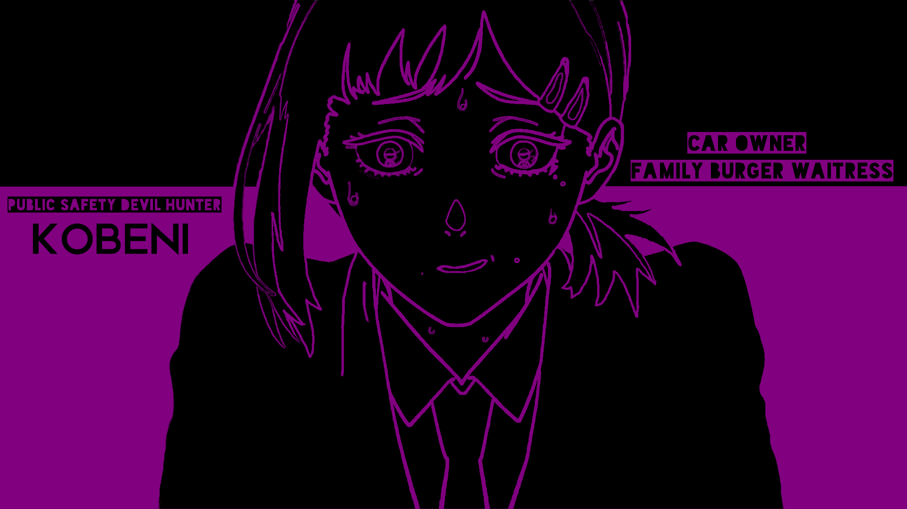

# 🖼️ steganography - Image Steganography in Rust

`steganography` (formerly `cryimg`) is a Rust-based CLI tool that hides encrypted messages inside images using LSB (Least Significant Bit) steganography. It supports optional encryption algorithms (like XOR), and allows deterministic or randomized bit placement using a PRNG seed.

---

## 🚀 Features

- 🧊 Embed and extract messages in `.jpg`, `.jpeg`, and `.png` images
- 🔐 Optional message encryption (XOR, AES, Caesar, Rot13, None)
- 🎲 Deterministic pseudo-random embedding with seed support
- 🧪 Built-in test suite for validation

---


## ⚙️ Build & Run

### 1. 📥 Build the project
```bash
cargo build --release
```

### 2. Get help
```bash
cargo run -- -h
```

### 3. 🖊️ Embed a message
```bash
cargo run -- --img <image-path> --msg <"your msg here"> --out <output-path.png> \
--encrypt <encryption-algo> --key <your-key> --prng --seed <your-seed-for-prng>
```

or 

```bash
./target/release/cimg  --img <image-path> --msg <"your msg here"> --out <output-path.png> \
--encrypt <encryption-algo> --key <your-key> --prng --seed <your-seed-for-prng>
```
- note: use `-h` for more help

### 3. 🔍 Decrypt the message
```bash
cargo run -- -i <encrypted-image-path> --decrypt <decryption-algo> --key <your-key> --prng --seed <your-seed-for-prng>
```

or

```bash
./target/release/cimg -i <encrypted-image-path> --decrypt <decryption-algo> --key <your-key> --prng --seed <your-seed-for-prng>
```

## 🧪 Run Built-in Tests
```rust
cargo test
```


## Add cimg to your bin
```Makefile
make
```
- This will add cimg to your `PATH`. Now you can run cimg from anywhere.

## Try to decrypt my maessage

- `hint`: `no...` hint for you (iykyk).